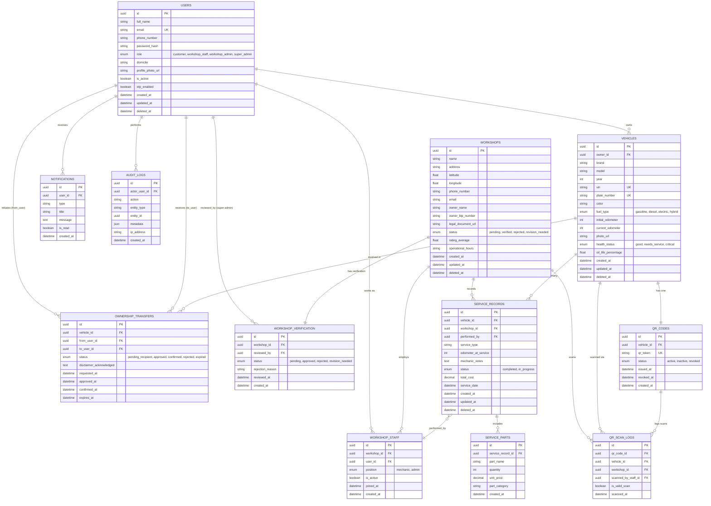

# ERD — MAINTIFY (SERVTRACK)
### Entity Relationship Diagram & Database Schema Detail

**Versi:** 1.0 | **Tanggal:** 02 Juli 2026
**Terkait:** PRD.md — Bagian 24 (Database Overview) & 25 (Entity Relationship Overview)

---

## 1. Diagram ERD (Mermaid)

---

## 2. Deskripsi Rinci Setiap Entitas

### 2.1 `users`
Menyimpan seluruh akun pengguna lintas role (Pelanggan, Pegawai Bengkel, Admin Bengkel, Super Admin). Role dibedakan melalui kolom `role`, sehingga tidak perlu tabel terpisah untuk masing-masing role — namun akses fitur tetap dikontrol melalui RBAC di level aplikasi/API.

| Kolom | Tipe | Keterangan |
|---|---|---|
| id | UUID (PK) | Identitas unik pengguna |
| full_name | VARCHAR | Nama lengkap |
| email | VARCHAR (UNIQUE) | Digunakan untuk login & notifikasi |
| phone_number | VARCHAR | Nomor kontak |
| password_hash | VARCHAR | Password terenkripsi (bcrypt/argon2) |
| role | ENUM | customer / workshop_staff / workshop_admin / super_admin |
| domicile | VARCHAR | Domisili (khusus pelanggan) |
| is_active | BOOLEAN | Status aktif akun |
| otp_enabled | BOOLEAN | Wajib true untuk super_admin |
| created_at / updated_at / deleted_at | TIMESTAMP | Audit trail dasar (soft delete) |

### 2.2 `vehicles`
Menyimpan data kendaraan milik pelanggan. Relasi `owner_id` akan berubah ketika terjadi transfer kepemilikan yang berhasil, namun histori kepemilikan sebelumnya tetap terekam pada tabel `ownership_transfers`.

### 2.3 `qr_codes`
Setiap kendaraan memiliki tepat satu QR Code aktif. `qr_token` bersifat unik dan terenkripsi (bukan ID sekuensial) untuk mencegah spoofing. Saat regenerasi, QR Code lama diberi status `revoked` dan QR Code baru dibuat sebagai entri baru.

### 2.4 `qr_scan_logs`
Mencatat setiap kejadian pemindaian QR Code, baik yang valid maupun tidak, untuk keperluan audit keamanan dan analitik penggunaan bengkel mitra.

### 2.5 `workshops`
Menyimpan data bengkel mitra beserta lokasi geografis (`latitude`, `longitude`) yang digunakan untuk fitur pencarian bengkel terdekat (geospatial query).

### 2.6 `workshop_staff`
Tabel penghubung (junction table) antara `users` (role workshop_staff/workshop_admin) dan `workshops`, memungkinkan satu bengkel memiliki banyak pegawai.

### 2.7 `workshop_verification`
Mencatat proses dan hasil verifikasi bengkel oleh Super Admin, termasuk alasan penolakan bila ada.

### 2.8 `service_records`
Entitas inti yang menyimpan setiap kejadian service kendaraan. Terhubung ke `vehicles`, `workshops`, dan `workshop_staff` (melalui `performed_by`) yang melakukan input.

### 2.9 `service_parts`
Menyimpan detail sparepart yang digunakan pada satu sesi service tertentu (relasi 1 : N terhadap `service_records`).

### 2.10 `ownership_transfers`
Mencatat seluruh proses transfer kepemilikan kendaraan, termasuk status tahapan (`pending_recipient`, `approved`, `confirmed`, `rejected`, `expired`) sesuai workflow pada PRD Bagian 29.

### 2.11 `notifications`
Menyimpan seluruh notifikasi in-app yang dikirimkan ke pengguna, dengan status baca (`is_read`).

### 2.12 `audit_logs`
Mencatat seluruh aktivitas penting/sensitif dalam sistem (perubahan data kendaraan, transfer kepemilikan, verifikasi bengkel, login Super Admin, dll) sebagai jejak audit yang immutable.

---

## 3. Ringkasan Relasi (Kardinalitas)

| Relasi | Kardinalitas |
|---|---|
| users (customer) → vehicles | 1 : N |
| vehicles → qr_codes | 1 : 1 (aktif) |
| qr_codes → qr_scan_logs | 1 : N |
| vehicles → service_records | 1 : N |
| service_records → service_parts | 1 : N |
| workshops → workshop_staff | 1 : N |
| users (staff) → workshop_staff | 1 : 1 |
| workshops → service_records | 1 : N |
| workshops → workshop_verification | 1 : 1 |
| vehicles → ownership_transfers | 1 : N |
| users → ownership_transfers (from/to) | 1 : N (dua relasi terpisah) |
| users → notifications | 1 : N |
| users → audit_logs | 1 : N |

---

## 4. Catatan Desain Database

- Seluruh Primary Key menggunakan **UUID** (bukan auto-increment integer) untuk menghindari penebakan ID pada endpoint publik (misalnya endpoint resolusi QR Code).
- Tabel-tabel inti (`vehicles`, `workshops`, `service_records`) menerapkan **soft delete** (`deleted_at`) agar data historis tidak hilang secara permanen, sejalan dengan NFR-013.
- Kolom `latitude` dan `longitude` pada `workshops` sebaiknya diindeks menggunakan ekstensi geospasial (misal PostGIS `GIST index`) agar query "bengkel terdekat" efisien pada skala data besar.
- `audit_logs` bersifat **append-only** — tidak ada operasi UPDATE/DELETE terhadap tabel ini di level aplikasi.
- Perubahan `owner_id` pada tabel `vehicles` hanya boleh dilakukan melalui service/endpoint transfer kepemilikan (bukan melalui update kendaraan biasa), untuk menjaga integritas proses transfer.
